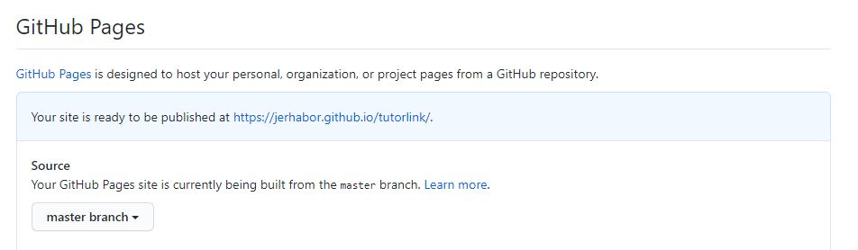
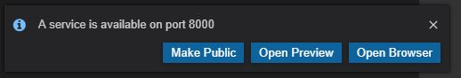
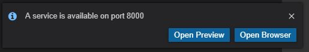
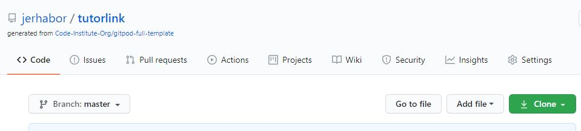

 
# TutorLink - Private Home Tutors

This website was created for parents & guardians who are in search of a private tutor for their children, as well as students who are well-versed in using technological devices to access and use this site to book a tutor. The site also promotes an opportunity for aspiring tutors to join and share their wealth of academic knowledge to those in need. The website is deployed to GitHub Pages and can be viewed [here](https://jerhabor.github.io/tutorlink/index.html).

Following the news of the COVID-19 pandemic, there has since been a strain on family members having to perform home-schooling duties for those still in school. TutorLink offers users the opportunity to alleviate this pressure by hiring a qualified tutor to guide their students to academic excellence. The key benefit of this, is that all sessions can take place in the comfort of their own homes. 

Currently, online sessions are strongly recommended for safety reasons. It is without a doubt a growing market thanks to the advancement of technology to the present day. The aim of the site is to connect students to tutors. Both parties can agree on their preferred video conferencing application to use for the online sessions. Times and dates of the sessions can also be settled in advance by email or text. This provides flexibility for both parties as lives adjust to the new normal. 
___
## Table of Contents

* [1. User Experience - UX](#1-user-experience---ux)
    + [1.1. User Stories](#11-user-stories)
    + [1.2. Structure and Skeleton Phases](#12-structure-and-skeleton-phases)
* [2. Features](#2-features)
    + [2.1. General Features](#21-general-features)
    + [2.2. Specific Features in Home](#22-specific-features-in-home)
    + [2.3. Specific Features in Tutors](#23-specific-features-in-tutors)
    + [2.4. Specific Features in Subjects](#24-specific-features-in-subjects)
    + [2.5. Specific Features in Contact](#25-specific-features-in-contact)
    + [2.6. Features Left to Implement](#26-features-left-to-implement)
* [3. Technologies Used](#3-technologies-used)
* [4. Testing](#4-testing)
    + [4.1. Testing Features](#41-testing-features)
    + [4.2. Achievement of User Stories](#42-achievement-of-user-stories)
    + [4.3. Code Validation](#43-code-validation)
    + [4.4. Test on Different Browsers](#44-test-on-different-browsers)
    + [4.5. Test on Different Devices](#45-test-on-different-devices)
    + [4.6. Bugs and Problems](#46-bugs-and-problems)
* [5. Deployment](#5-deployment)
* [6. Credits](#6-credits)
    + [6.1. Content](#61-content)
    + [6.2. Media](#62-media)
    + [6.3. Acknowledgements](#63-acknowledgements)

<small><i><a href='http://ecotrust-canada.github.io/markdown-toc/'>Table of contents generated with markdown-toc</a></i></small>

***

## 1. User Experience - UX

This project hosts a platform to encourage further learning for students. TutorLink enables the experienced to share and the students to learn at greater depths than they normally would in school. This means that tutors will be able to provide mentorship to students and coach them through their academic journey. To illustrate the connection that this site brings between tutors and students, the name "TutorLink" was therefore birthed.

The primary target audience are students and parents/guardians who will sign up on behalf of their children.

The secondary target audience are aspiring tutors.

### 1.1. User Stories
As part of the _Stategy_ stage in the five planes of UX, I deemed it necessary to undertake a strategic research process. This involved asking several people what they would expect from this website and tying in these ideas to realise the project goals of TutorLink. The target audience came with the following suggestions:

**User Story 1:**
> "As a GCSE student, I would like the website to be easy to navigate so that I can see what it offers as quickly as possible."

**User Story 2:**
> "As a tutor, I would love to see testimonials from people who have been taught by TutorLink as this will help me in promoting it to other people."

**User Story 3:**
> "As a parent of both KS2 and 11+ students, I want to be able to sign up easily so that once I decide to do so, it is quickly over and done with."

**User Story 4:**
> "As an A-Level student, there should be the option to choose between face-to-face and virtual tutoring."

**User Story 5:**
> "As a parent of an 11+ student, I want your site to convince and reassure me in numerous ways why I should sign up."

**User Story 6:**
> "As an A-Level student, I would like to see the full list of tutors so that I can familiarise myself with my chosen tutor's background beforehand."

**User Story 7:**
> "As a GCSE student, I would like to see subjects linked to any recommended revision material so that I can obtain them prior to the first session.

These user requirements were traded off and aligned with the stategies of TutorLink in order to establish the project scope. This was predominantly a brainstorming activity to propose and develop innovative solutions. 

After consultations with my mentor to help gather an initial scope, I then drafted up wireframes for the website in both desktop and mobile versions as well as a moodboard for potential elements and characteristics of the site. 

I have compiled my project development files in a folder which can be viewed [here](https://github.com/jerhabor/tutorlink/tree/master/assets/project-development).

### 1.2. Structure and Skeleton Phases
My systematic approach was to create an invisible loop between these two phases of UX design, to reassure that my deliverables would be an optimal fit for the target audience's requirements. I made sure that my wireframes were at least a good representation of how I wish to present information and how well users will be able to interact with it. 

I used [Balsamiq Wireframes](https://balsamiq.com/) to construct my mockups. However, there were limited features on this software to illustrate what I intended to present (e.g. colours, animation etc). These extra features were noted down and I decided to progress with building the outline/template of the website by block commenting out section headings in my GitPod workspace.

## 2. Features

This section will detail the _Surface_ phase of the project.

TutorLink comprises of four pages, namely: 
* [Home](https://jerhabor.github.io/tutorlink/index.html) 
* [Tutors](https://jerhabor.github.io/tutorlink/tutors.html) 
* [Subjects](https://jerhabor.github.io/tutorlink/subjects.html)
* [Contact](https://jerhabor.github.io/tutorlink/contact.html)

### 2.1. General Features

#### 2.1.1. Navigation bar  
A good first impression always counts. The passion red background colour with the contrasting white font colour, gives the site a warm and welcoming mood. The `active` page is in bold and hover effects are applied to the non-active menu items. The *"Sign Up"* button has a gold background colour so that it stands out to users. I also used the following Bootstrap class to make the header stick on scroll, to a length equivalent to the height of the device's viewport:
~~~
<nav class="sticky-top">
~~~

#### 2.1.2. Sign Up Modal Form  
This allows the primary target audience to easily sign up in one click. At first glance, this can be accessed by clicking the **_Sign Up_** button on the navigation bar. 
There are also **_Sign Up Now_** buttons on each page located in: 
- Each page's `footer`
- The `jumbotron` on the **Home** page
- The [`top-subjects`](assets/testing/user-stories/top-subjects.JPG) collapsible button on the **Subjects** page
- Under _"Book a Tutor"_ on the **Contact** page

#### 2.1.3. Header  
The [Tutors](https://jerhabor.github.io/tutorlink/tutors.html), [Subjects](https://jerhabor.github.io/tutorlink/subjects.html) and [Contact](https://jerhabor.github.io/tutorlink/contact.html) pages have background photos with a short caption to indicate what the page offers to users. The [Home](https://jerhabor.github.io/tutorlink/index.html) page however uses a `carousel` as I wanted to communicate more to users what TutorLink is; without them having to click anything or anywhere else.

#### 2.1.4. Background  
I decided to use a plain white background which is a nice contrast to the deep passion red `navbar` and `footer`. This allows users to read information clearly as the font colour used were predominantly dark.

#### 2.1.5. Fonts Used  
TutorLink uses Google Fonts. I chose _Audiowide_ for the TutorLink logo to provide a simple, edgy and futuristic feel to its name. _Montserrat_ was used as the main font for `<h1>`, `<h2>` and `<h3>` elements because of the wide letter-spacing which ensures clarity of textual information to all viewers.  _Roboto_ was used for all other texts.

#### 2.1.6. Testimonials  
Located before the footer, this section also uses a carousel so that users can read multiple reviews in a short space of time without having to click elsewhere on the site. I created my bespoke circular bottom indictors by:

    ~~~ 
    #reviews-slides li {
    width: 10px;
    height: 10px;
    border-radius: 100%;
    background-color: #000;
    }
    ~~~

#### 2.1.7. Navigation Button "Back-To-Top"  
Even though the majority of today's users prefer to scroll, I created this button for easy access to the top of the page. I believe this would be particularly useful for the older generation who may be more familiar with just clicking links to get them somewhere.

#### 2.1.8. Footer  
To create consistency across the site, The `footer` has the same colour theme as the `navbar`. This section only contains the social links and the *"Sign Up Now"* button that will load a modal form for the user to fill in.

### 2.2. Specific Features in Home

#### 2.2.1. Carousel Header  
I used three background images as carousel items with captions that summarise the type of tutors that TutorLink offers.

#### 2.2.2. Tutorlink Introduction  
This section sits below the carousel to give concise information about the company.

#### 2.2.3. Mission Statements  
The use of icons helps the user with visual communication instead of just plain words.

#### 2.2.4. Selling Point  
In order to captivate users, it is advised to use more than one means of communication. Up until this point, I have used text and images. So I decided to embed a youtube video in an `iframe` which provides both video and audio; which can be more captivating.

#### 2.2.5. Statistics  
The aim of this section is to convince users by demonstrating genuine results. I have therefore provided this section as a different means of encouraging users to get help with TutorLink.
    
#### 2.2.6. Jumbotron  
This section reminds the user to sign up. I decided to add `animation` effects to make it stand out so that in the event of scrolling, users can see it easily. I needed it to stand out after the YouTube video and listing the success rates.

#### 2.2.7. Two-column Site Navigation Section  
By using this alternating pictures and text layout, the user will be more engaged in taking in more content of the site.

### 2.3. Specific Features in Tutors

#### 2.3.1. Qualifications  
The section provides a list of achievements that the tutors have which demonstrate experience and ability to deliver good tuition and in good manner.

#### 2.3.2. Mini-Profiles  
For further user-interaction with the page content - I used a Sepia filter on the profile images. They turn to their original colour when a mouse hovers over them in desktop mode or when the user taps them in mobile/tablet devices.

### 2.4. Specific Features in Subjects

#### 2.4.1. Top Subjects  
For reference, this element has `class="top-subjects"`. By displaying to users what the top subjects are, this creates a sense of urgency for them to make a decision. The top subjects are already listed on the Home page in the "Two-column site navigation" section but are also advertised in this Subjects section. Seeing as maths is a popular subject, this feature aims to speed up users decision-making time; especially for those who are looking for maths tutors.

#### 2.4.2. "What We Offer" Section  
This feature gives the user clear information on the pricing and method of teaching; both of which play a huge part in their decision.

#### 2.4.3. Navigation to Subject Groups  
Due to the amount on content on this page, when clicked, this feature allows users to go straight to the subject group they are interested in to save scrolling effort.

#### 2.4.4. Subjects  
The content makes it clear to users what the subject is about. The subjects are also linked to recommended revision material where users can purchase them.

### 2.5. Specific Features in Contact

#### 2.5.1. Contact Introduction  
Simple layout stating administration service opening times and expected response times after submitting forms/emails.

#### 2.5.2. Contact Body  
The two sections *"Book a Tutor"* and *"Become a Tutor"* separates the target audience and allows them to fulfil their intended goal on visiting the page.

### 2.6. Features Left to Implement
These features are not included in this version of the project. The main reason being that they are currently not a necessity in order to fulfill the user-requirements. However there is potential for the brand to grow; so the following features can improve user-experience and increase marketability:

* Incorporate [Calendly](https://calendly.com/pages/integrations/embed) so that users can book sessions online without awaiting confirmation from tutors (inspired by Code Institute's Mentor's Calendar).
* Ability to book your own tutor:
    * This feature will only be considered and designed when the number of tutors per subject are significant enough for tutor selections to be made.
* Provide daily/weekly tips on the site regarding how to cope under the pressure of exams and how to study effectively with recommended revision techniques.
* Selling of TutorLink-branded stationery and guides/books.
* Access to exam-style questions created by TutorLink tutors.
* Members/Students portal and forums so that users can keep track of sessions and engage with other TutorLink users.

## 3. Technologies Used

- [Git](https://git-scm.com/) - TutorLink uses Git as a version control system during its development.
- [GitPod](https://www.gitpod.io/) - This is an online Integrated Development Environment (IDE) used to build TutorLink.
- [HTML5](https://en.wikipedia.org/wiki/HTML5) - HTML stands for Hypertext Markup Language and it is the backbone of TutorLink. The latest version - HTML5 - was used to add and structure the site content.
- [CSS3](https://en.wikipedia.org/wiki/Cascading_Style_Sheets) - CSS stands for Cascading Style Sheets. The latest version - CSS3 - was used to style all HTML content of TutorLink.
- [Bootstrap](https://getbootstrap.com/) - TutorLink uses Bootstrap's grid system to layout site content in a structured manner. The framework also provides some assistance to styling with `class` names.
- [Google Fonts](https://fonts.google.com/) - This font library offers a wide variety of font styles for selection, to help in the site's mood design. This project uses _Audiowide_, _Montserrat_ and _Roboto_.
- [Font Awesome](https://fontawesome.com/) - TutorLink uses this icon library with its great selection of icons, to add to the visual aesthetics of the site content.
- [JavaScript](https://www.javascript.com) - My mentor recommended including his HTML Document Object Model (DOM) manipulation to produce a feedback box after a user presses Submit on the *"Sign Up"* modal form.
- [JQuery](https://jquery.com/) - TutorLink uses JQuery for effects, animations and loading up the modal form. 
- [Balsamiq](https://balsamiq.com/) - Used to construct my wireframes in the skeleton phase of UX.

## 4. Testing

### 4.1. Testing Features
#### 4.1.1. Navigation bar  
- For screen sizes with widths smaller than 840px, a hamburger icon appears on the right.
- The hamburger icon toggles the collapsible element with the menu items when clicked.
- When the cursor hovers over each of the menu items (apart from the *"Sign Up"* button), they turn to bold for as long as the cursor stays on it.
- When the cursor hovers over the *"Sign Up"* button, the button scales up in size by 10%, the font colour turns white and the `background-color` turns grey due to Bootstrap's `class="btn btn-outline-secondary"`. The style.css sets the `transition` to 0.5s for a smooth `hover` on and off:
    ~~~
    #navbarNav li button:hover {
    font-family: 'Montserrat', sans-serif;
    color: #fff;
    background-color: #808080;
    border-color: #000;
    transition: 0.5s;
    -webkit-transition: 0.5s;
    -moz-transition: 0.5s;
    -ms-transition: 0.5s;
    transform: scale(1.1);
    -webkit-transform: scale(1.1);
    -moz-transform: scale(1.1);
    -ms-transform: scale(1.1);
    }   
    ~~~
- Each menu item link takes the user to the required page.
- The TutorLink logo on the top left when clicked, takes the user back to the home page.
- The Navigation bar is sticky for the length of the device's screen height.
- All navigation items function as intended.

#### 4.1.2. Sign Up to Book a Tutor 
The pop-up modal loads up correctly after clicking: 
- The *"Sign Up"* button on the navigation bar.
- The *"Sign Up Now"* button in the footer, Home page `jumbotron` and Subjects page `top-subjects` button.
- The *"Sign Up Now"* button under *"Book a Tutor"* on Contact page.

An error message is displayed if:
- The user tries to submit an empty form.
- [Not all input boxes have been filled in](assets/testing/user-stories/modal-error.JPG).
- An [invalid email address](assets/testing/user-stories/modal-error2.JPG) is given.

After submission, a display box appears with the message: _"Thank you, we have received your request. We will be in touch with you within 24 hours."_

#### 4.1.3. Apply to Become a Tutor  
On the Contact page underneath *"Become a Tutor"*, there are two parts to the form. 
- _"No file chosen"_ under *"Upload CV"* is replaced by the file name when the corresponding file has been uploaded.
The form cannot be submitted until: 
- A file has been selected.
- A covering letter has been typed in the text box.

After submission, the same display box as in [4.1.2.](#412-sign-up-to-book-a-tutor) appears with the message: _"Thank you, we have received your request. We will be in touch with you within 24 hours."_

#### 4.1.4. Access TutorLink's Social Links  
- Social Links are located in the `footer`.
- On `hover`, the icon's `color` and `background-color` switch colours.
- For educational purposes, the socials icons are linked to the corresponding home pages (e.g. the Facebook icon loads up the Facebook home page when clicked).
- All links open up in a new tab after including the attribute `target="_blank"` in the `` tags.

#### 4.1.5. "Why Do You Need A Tutor" YouTube Video  
- The `iframe` is responsive and displays accordingly on all screen sizes.
- The embedded video does not play automatically but allows the user to control the play button.
- The YouTube features of the video are enabled for the user to control after they press play.
- The user can click the video title to be directed to the YouTube video link in a new tab.

#### 4.1.6. Testimonials
- This section is responsive and displays accordingly on all screen sizes.
- The larger the screen size, the more whitespace to the left and right of the section. 
- For a larger screen size, this surrounding whitespace helps the user read the text more easily rather than having to pan across the large screen width.
- When the cursor hovers over the carousel, it stops moving automatically.

#### 4.1.7. View Recommended Revision Material
- When the cursor hovers over each subject, a black border appears over the item to notify the user of the selected item.
- All links open up in a new tab after including the attribute `target="_blank"` in the anchor tags.  

### 4.2. Achievement of User Stories

**User Story 1:**
> "As a GCSE student, I would like the website to be easy to navigate so that I can see what it offers as quickly as possible."

Features: [2.1.1](#211-navigation-bar), [2.2.7](#227-two-column-site-navigation-section)
- Navigation bar: 
    - [`min-width: 840px`](assets/testing/user-stories/navbar-desktop.JPG)
    - [`max-width: 839px`](assets/testing/user-stories/navbar-mobile.jpg)
    - [`max-width: 839px`](assets/testing/user-stories/navbar-mobile-open.jpg) (toggle open)
- [Home page two-column section](assets/testing/user-stories/two-column-section-home.jpg)

**User Story 2:**
> "As a tutor, I would love to see testimonials from people who have been taught by TutorLink as this will help me in promoting it to other people."

Feature: [2.1.6](#216-testimonials)
- [`min-width: 992px`](assets/testing/user-stories/testimonials-laptop.JPG)
- [`min-width: 768px and max-width: 991px`](/assets/testing/user-stories/testimonials-ipad.JPG)
- [`max-width: 767px`](assets/testing/user-stories/testimonials-mobile.JPG)  

**User Story 3:**
> "As a parent of both KS2 and 11+ students, I want to be able to sign up easily so that once I decide to do so, it is quickly over and done with."

Features: [2.1.1](#211-navigation-bar), [2.1.8](#218-footer), [2.2.6](#226-jumbotron), [2.4.1](#241-top-subjects), [2.5.2](#252-contact-body)  
Sign up buttons are located in several places on the site for ease:
- [Navigation bar](assets/testing/user-stories/navbar-desktop.JPG)
- [Jumbotron](assets/testing/user-stories/jumbotron-mobile.JPG)
- [Footer](assets/testing/user-stories/footer-mobile.JPG)
- [Subjects Page](assets/testing/user-stories/top-subjects-open.JPG)
- [Contact Page](assets/testing/user-stories/contact-mobile.JPG)  

**User Story 4:**
> "As an A-Level student, there should be the option to choose between face-to-face and virtual tutoring.

Feature: [2.4.2](#242--what-we-offer--section)

The introductory paragraph and table beneath the page header on the **Subjects** page states the options and details the rates. A screenshot can be viewed [here](assets/testing/user-stories/subjects-intro-chrome.jpg). 
- I did not add this choice of option to the modal form to give flexibility between the student and the tutor when switching from face-to-face to online and vice versa. A great example is the COVID-19 pandemic where only online sessions were permitted.  

**User Story 5:**
> "As a parent of an 11+ student, I want your site to convince and reassure me in numerous ways why I should sign up."

Features: [2.1.6](#216-testimonials), [2.2.3](#223-mission-statements), [2.2.4](#224-selling-point), [2.2.5](#225-statistics)
The Home page offers different means of persuading the user to sign up namely:
- [Mission Statements](https://github.com/jerhabor/Milestone-Project-1/blob/df6eea83e939a84c8c8530a102aae0992e976182/assets/testing/user-stories/mission-statements.JPG)
- ["Why Do You Need A Tutor" iframe YouTube video](assets/testing/user-stories/selling-point.JPG)
- [Statistics](assets/testing/user-stories/statistics.JPG)  

**User Story 6:**
> "As an A-Level student, I would like to see the full list of tutors so that I can familiarise myself with my chosen tutor's background beforehand."

Feature: [2.3.2](#232-mini-profiles)

The **Tutors** page is dedicated to a [full list of Tutors](assets/testing/browsers/tutors-win10-chrome.png)  

**User Story 7:**
> "As a GCSE student, I would like to see subjects linked to any recommended revision material so that I can obtain them prior to the first session."

Feature: [2.4.4](#244-subjects)

- Can be accessed by clicking on **Subjects** in Navigation bar
- Click on the subject group to be directed to the required section of the page to choose subject - alternatively the user can scroll straight to the subject.
- Click the card to open up a link in a new browser tab. Click [here](assets/testing/user-stories/recommended-revision-material.gif) for an illustration.

#### User Feedback
The TutorLink website has been tested with my family, mentor and friends. The following words were given:
> "This site is so clear and easy to navigate!"

> "I love the choice of colours and fonts!"

> "This website has a professional touch to it!"

> "All pages are responsive and looks great on both my mobile phone and laptop."

> "The Tutors and Subjects pages are very creative!"

### 4.3. Code Validation
**HMTL Code Validation**  
All HTML documents passed with no warning or errors using the [W3C HTML Validator](https://validator.w3.org/) namely: 
- [index.html](assets/testing/validation/home.JPG)
- [tutors.html](assets/testing/validation/tutors.JPG)
- [subjects.html](assets/testing/validation/subjects.JPG)
- [contact.html](assets/testing/validation/contact.JPG)  

**CSS Code Validation**  
The stylesheet, [style.css](assets/testing/validation/css.JPG), passed with no errors using the [W3C CSS Validator](https://jigsaw.w3.org/css-validator/validator).

### 4.4. Test on Different Browsers

Key: &#x2714; = Functions well  
(Click on the ticks in the table below to view screenshots)  

|      Browser      | Version |   Home   |   Tutors  | Subjects |  Contact |                         Notes                         |
|:-----------------:|:-------:|:--------:|:---------:|:--------:|:--------:|:-----------------------------------------------------:|
|       Chrome      |    80   | [&#x2714;](assets/testing/browsers/home-win10-chrome.png) |  [&#x2714;](assets/testing/browsers/tutors-win10-chrome.png) | [&#x2714;](assets/testing/browsers/subjects-win10-chrome.png) | [&#x2714;](assets/testing/browsers/contact-win10-chrome.png) |                                                       |
|      Firefox      |    74   | [&#x2714;](assets/testing/browsers/home-win10-firefox.png) |  [&#x2714;](assets/testing/browsers/tutors-mac-os-firefox.png) | [&#x2714;](assets/testing/browsers/subjects-win10-firefox.png) | [&#x2714;](assets/testing/browsers/contact-mac-os-chrome.png) |                                                       |
|       Safari      |    13   | [&#x2714;](assets/testing/browsers/home-mac-os-safari.png) |  [&#x2714;](assets/testing/browsers/tutors-mac-os-safari.png) | [&#x2714;](assets/testing/browsers/subjects-mac-os-safari.png) | [&#x2714;](assets/testing/browsers/contact-mac-os-safari.png) |                                                       |
| Internet Explorer |    11   | [&#x2714;](assets/testing/browsers/home-win10-ie.png) | [&#x2714;](assets/testing/browsers/tutors-win10-ie.png)* | [&#x2714;](assets/testing/browsers/subjects-win10-ie.png) | [&#x2714;](assets/testing/browsers/contact-win10-ie.png) | *The css __filter__ property is not supported&#x00B9; |
|        Edge       |    79   | [&#x2714;](assets/testing/browsers/home-win10-edge.png) |  [&#x2714;](assets/testing/browsers/tutors-win10-edge.png) | [&#x2714;](assets/testing/browsers/subjects-win10-edge.png) | [&#x2714;](assets/testing/browsers/contact-win10-edge.png) |                                                       |
|       Opera       |    67   | [&#x2714;](assets/testing/browsers/home-mac-os-opera.png) |  [&#x2714;](assets/testing/browsers/tutors-win10-opera.png) | [&#x2714;](assets/testing/browsers/subjects-win10-opera.png) | [&#x2714;](assets/testing/browsers/contact-mac-os-opera.png) |                                                       |

&#x00B9; It must be noted that although all tutor profiles displayed in an Internet Explorer browser do not have a sepia filter, this does not change the user's purpose and intent of this page.

### 4.5. Test on Different Devices

Key: &#x2714; = Displays as intended

|          Device         | Viewport (Width x Height) |   Home   |  Tutors  | Subjects |  Contact |
|:-----------------------:|:-------------------------:|:--------:|:--------:|:--------:|:--------:|
|         Moto G4         |         360 x 640         | &#x2714; | &#x2714; | &#x2714; | &#x2714; |
|        Galaxy S5        |         360 x 640         | &#x2714; | &#x2714; | &#x2714; | &#x2714; |
|        Galaxy S7        |         360 x 640         | &#x2714; | &#x2714; | &#x2714; | &#x2714; |
|         Pixel 2         |         411 x 731         | &#x2714; | &#x2714; | &#x2714; | &#x2714; |
|        Pixel 2 XL       |         411 x 823         | &#x2714; | &#x2714; | &#x2714; | &#x2714; |
|       iPhone 5/SE       |         320 x 568         | &#x2714; | &#x2714; | &#x2714; | &#x2714; |
|       iPhone 6/7/8      |         375 x 667         | &#x2714; | &#x2714; | &#x2714; | &#x2714; |
|    iPhone 6/7/8  Plus   |         414 x 736         | &#x2714; | &#x2714; | &#x2714; | &#x2714; |
|         iPhone X        |         375 x 812         | &#x2714; | &#x2714; | &#x2714; | &#x2714; |
|           iPad          |         768 x 1024        | &#x2714; | &#x2714; | &#x2714; | &#x2714; |
|         iPad Pro        |        1024 x 1366        | &#x2714; | &#x2714; | &#x2714; | &#x2714; |
| Sony Bravia  Television |   55-inch diagonal (4K)   | &#x2714; | &#x2714; | &#x2714; | &#x2714; |

 For most of the project development, Chrome's DevTools were used. Upon completion, [BrowserStack](https://www.browserstack.com/) was used to test simulated user interaction with TutorLink on different devices. Screen recordings of these were made using [Apowersoft](https://www.apowersoft.com/free-online-screen-recorder?__c=1).

 ### 4.6. Bugs and Problems

#### 4.6.1. Brightness of Page Headers  
All browsers, apart from Internet Explorer, displayed all aspects of the website as intended. 

Internet Explorer does not support filters with [evidence from caniuse.com](assets/testing/browsers/caniuse-filter.JPG). This implies an innovative approach to reduce the `brightness` of the page headers. 

Using the Home page carousel as an example, I had to alter `.carousel-caption` and assign a black `background-color` and opacity of 0.7. As `position: absolute;` this overlays the `.carousel-item` with `position: relative;`.
~~~
.carousel-item {
    width: 100%;
    max-height: 470px;
    overflow: hidden;
    position: relative;
}

.carousel-caption {
    position: absolute;
    top: 50%;
    transform: translateY(-50%);
    -webkit-transform: translateY(-50%);
    -moz-transform: translateY(-50%);
    -ms-transform: translateY(-50%);
    background: rgba(0,0,0,0.7);
    left: 0%;
    width: 100%;
    height: 100%;
}
~~~

#### 4.6.2 Slow loading of some images
When loading up TutorLink for the first time or after clearing out browser cache, it is likely that the following images may take a few seconds to load:
- Page header background images on the **Tutors**, **Subjects** and **Contact** pages.
- Profile images on the **Tutors** page.

All of these images have been compressed to as much as its clear quality remains intact. Though not a major issue, this disclaimer is to inform the user that they could experience some delay in full-page loading and this is already acknowledged.

## 5. Deployment

TutorLink is deployed to GitHub Pages using its `master` branch; the only available branch at the moment.  
The deployed link is: [https://jerhabor.github.io/tutorlink](https://jerhabor.github.io/tutorlink/).

### To deploy:
- Go to TutorLink [GitHub repository](https://github.com/jerhabor/tutorlink)
- Click on Settings (above the green _"Clone"_ button)
- Scroll down to **GitHub Pages**
- Under source, select the `master` branch
- The page will automatically refresh and the following will be seen:

### Developing/Editing code:

In the event of making changes to code externally (i.e. not in an IDE workspace such as GitPod), `commit` changes so that you can use `git pull` in the IDE.

When working in GitPod IDE, the process to push to the repository is as follows:
~~~
$ git status
$ git add (insert file name)
$ git commit -m "(classify change and mention why changes were made for this version)"
$ git push
~~~

To track all files/add to storage area all at once, use instead:
~~~
$ git add .
~~~

### Running file locally  

In the IDE terminal, type:
~~~ 
$ python3 -m http.server
~~~

The following pop-up box will appear:  
  

Click *"Make Public"* so that it is viewable on other devices with the browser link. The following box will now appear:  

Click *"Open Browser"* and a new tab will run the code from the IDE locally.  

**Key Notes:**
* You must save changes in your documents in order to see the reflected product when running locally.  
* Try clearing the browser cache if changes to code do not seem to be running when saved.

### Clone Repository
- Go to TutorLink [GitHub repository](https://github.com/jerhabor/tutorlink)
- Click on the green _"Clone"_ button and a dropdown will appear. You will see:  
  

You can choose to:
- Copy link to clipboard and paste in the browser address bar.  
- Alternatively, click _"Open in Desktop"_ to use GitHub desktop.

## 6. Credits

**Software Developer: Jess Erhabor**

### 6.1. Content
- My mentor, Caleb, provided me with a short JavaScript HTML DOM manipulation. The following code is found on **line 57 in index.html, tutors.html and subjects.html** as well as **line 56 in contact.html**: 
    ~~~
    onsubmit="alert('Thank you, we have received your request. We will be in touch with you within 24 hours.'); return false;"
    ~~~ 

- The following Media Query for **Navbar** found in lines 193 - 209 of style.css was sourced from [Stack Overflow](https://stackoverflow.com/questions/19827605/change-bootstrap-navbar-collapse-breakpoint-without-using-less):
    ~~~
    .navbar .navbar-header {
        flex-wrap: nowrap;
    }
    .navbar-expand-custom .navbar-nav {
        flex-direction: row;
    }

    .navbar-expand-custom .navbar-nav .nav-link {
        padding-right: 0.5rem;
        padding-left: 0.5rem;
    }
    .navbar-expand-custom .navbar-collapse {
        display: flex!important;
    }
    .navbar-expand-custom .navbar-toggler {
        display: none;
    }
    ~~~

### 6.2. Media
The photos and images used in this site are for educational purposes only and were obtained from:
* [Pexels](https://www.pexels.com/) - for the page headers and most of the tutor profile images.
* [Exam Paper Plus](https://exampapersplus.co.uk/) - for some of the subjects on the **Subjects** page (namely maths and science-based subjects).
* [Google Images](https://www.google.com/imghp?hl=en) - for the remaining subjects, which I then used to overlay on the same background colours from Exam Paper Plus.

### 6.3. Acknowledgements

- My mother - for coming up with the brand name TutorLink.
- My mentor [Caleb](https://github.com/calebmbakwe) - for his guidance from conception to deployment.
- My family - for testing the site and providing constructive feedback.
- My Slack community - for the encouragement and general guidance from day one.
